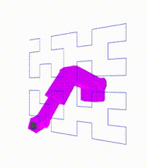

# saxis - a 6 degrees of freedom robot arm

## Overview

This program models a 6 degrees of rotational freedom robot arm using
the [`sixaxis`](https://pkg.go.dev/zappem.net/pub/kinematics/sixaxis)
kinematics package. The arm renders via a web page using the
[three.js](https://threejs.org/) rendering API.

To run the program you should do:
```
$ git clone https://github.com/tinkerator/saxis
$ cd saxis
$ git submodule init
$ git submodule update
$ go mod tidy
$ go build
$ ./saxis
```

**NOTE** The `git submodule ...` parts are to cache a local copy of the
	 `three.js` sources that are needed to get the 3D rendering of the
	 robot to work.

Then you point your web browser at http://localhost:8080 and watch the
saxis robot dance a Hilbert curve with the various modes of movement
that it supports.

What you see looks like this:



The `saxis` program cycles through a series of programmed sequences:
program numbers 1, 2, ... There are 4 distinct sequences that
endlessly repeat. They deomonstrate the
[`zappem.net/pub/kinematics/sixaxis`](https://pkg.go.dev/zappem.net/pub/kinematics/sixaxis)
robot motion patterns as follows:

- 1,5,9,... `Joined` mode determines the pose for the robot at the
  next node of the Hilbert curve and smoothly interpolates all of the
  joint angles from the last pose to that pose. It sort of follows the
  curve.

- 2,6,10,... `Arc` mode subtends an arc of `--arc` degrees (defaults
  to 120) between the nodes of the Hilbert curve. The robot only
  intersects the curve at these nodes and otherwise bounces away from
  the line.

- 3,7,11,... `Linear` mode rigidly follows the actual linear segments
  of the Hilbert curve. This motion is the most *robotic*.

- 4,8,12,... `Near` mode is the most fluid motion. It cuts the corners
  (nodes) of the Hilbert curve leaving the official line at about
  1/7th of the line from each node. It is this program that is
  recorded ("OFF AIR" -> "ON AIR") for later saving via the "SAVE
  VIDEO" button. If you click this labeled button, a `sample.webm`
  video file is saved where your browser saves files (and not the
  working directory of the `saxis` program).

## Notes for submodules

This was the setup for the [threejs](https://github.com/mrdoob/three.js) code:

```
$ git submodule add https://github.com/mrdoob/three.js.git
```

The various *...min.js* files from this submodule are symbolically
linked from `./html/js/` locations.

## License info

The `saxis` program is distributed with the same BSD 3-clause license
as that used by [golang](https://golang.org/LICENSE) itself. Viewing
in a browser depends on [`three.js`](https://threejs.org/) to render
its image in a browser and that has its own MIT license.

## Reporting bugs and feature requests

The `saxis` program was developed purely out of self-interest to try
to understand how robots like this work. Should you find a bug or want
to suggest a feature addition, please use the [bug
tracker](https://github.com/tinkerator/saxis/issues).
